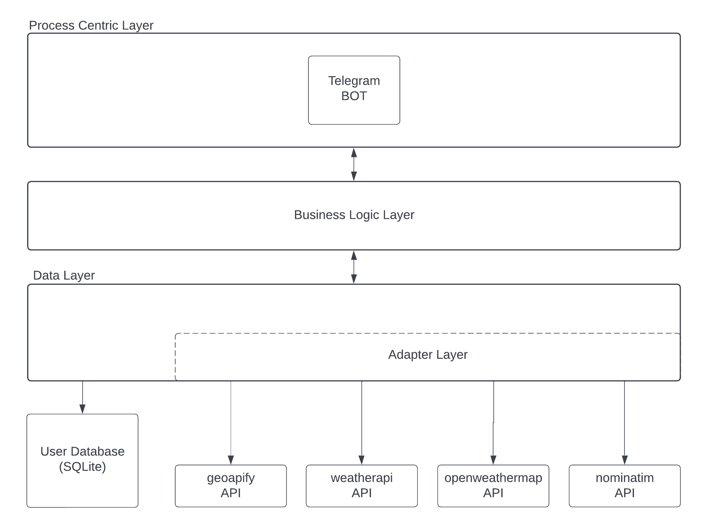
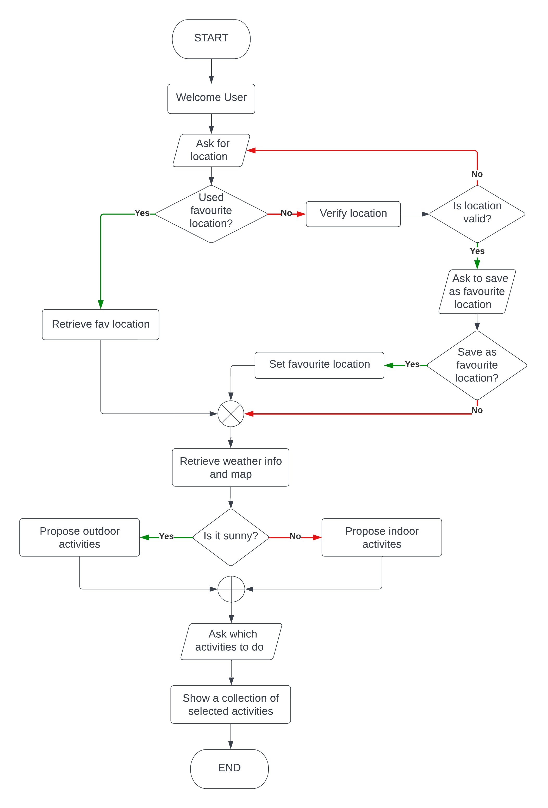

# sde-project-2023

## Description
The final project of the 2022/2023 a.y. University of Trento master course "Service Design and Engineering (SDE)" is a Telegram bot which sends a short report of the current weather with a weather map, given a place or given geographic coordinates sent as position.  
Depending on the quality of the forecasts, a list of suitable places of interest such as parks, museums with bad weather or outdoor parks with sunny weather with an indication of how to reach them is suggested.  
It's also possible to request the estimated forecasts for the next 3 days.  
Furthermore the user can save a favourite location and recall the weather without sending the name or the position every time.

## Project diagram
The architecture of the main services is the following:  


## How to run
Set the environment variables in the following files:
- `.env` file of the `telegram_bot` folder, given the example in the `telegram_bot/.env.sample` file;
- `secrets.js` file of the `data-layers` folder, given the example in the `data-layers/secrets.sample.js` file;

Run the containers with the following command in the root folder:
```bash
docker-compose up
```
At this point, the bot is listening and ready to be used.

## Documentation
* Data layer: [http://localhost:8083/api/docs](http://localhost:8083/api/docs)
* Business logic layer: [http://localhost:8084/api/docs](http://localhost:8084/api/docs)
* Process centric layer: 
